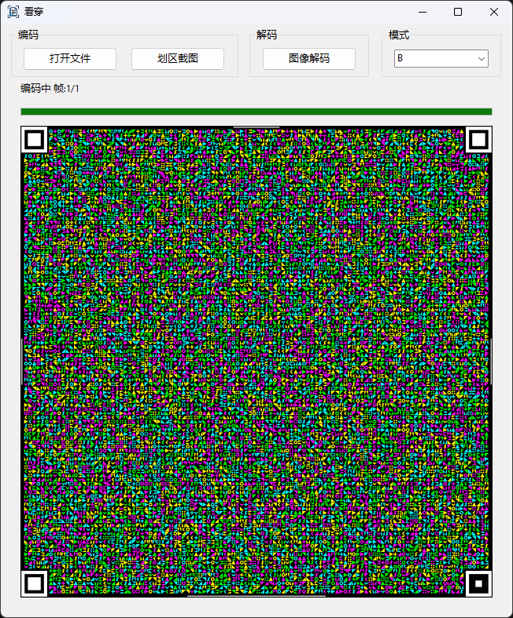

# 看穿 (KanChuan)

基于 [libcimbar](https://github.com/sz3/libcimbar) 的 Windows 移植版，使用 [aardio](https://www.aardio.com/) 开发 GUI 界面。

将文件编码为动态彩色二维码图像序列，通过摄像头实时解码还原文件，实现"看穿屏幕"的文件传输。



## 功能

- **文件编码**：将文件编码为 cimbar 动态图像序列，循环播放
- **分块传输**：超过 chunk大小(默认10MB)的文件自动分块编码，兼容 [cimbar-bigfile](https://github.com/xPeiPeix/cimbar-bigfile) manifest 协议格式，支持多 stream 解码逐块保存
- **划区截图**：截取屏幕区域图像进行编码
- **图像解码**：调用系统摄像头实时捕获 cimbar 图像并解码还原（未实测）
- **拖放支持**：直接拖放文件到窗口开始编码
- **多种模式**：支持 B / Bu / Bm / 4C 四种编码模式

## 用法

1. **文件编码**：点击"打开文件"选择文件，或直接拖放文件到窗口。程序自动生成动态图像序列循环播放。
   - 大文件分块编码，按 chunk 循环播放 manifest +各数据块
2. **截图编码**：点击"划区截图"，框选屏幕区域进行编码。
3. **图像解码**：点击"图像解码"，启动摄像头。将摄像头对准另一台设备上播放的 cimbar 动态图像，四角锚点变绿表示对齐成功(双击画布切换左右镜像，方便前置摄像头用户)，解码完成后保存文件。
   - 大文件分块解码，自动识别 manifest，收到每个 chunk 即时保存，全部完成后合并
4. **手机解码**：android手机端使用 [CFC](https://github.com/sz3/cfc/releases) 扫描解码。将手机摄像头对准彩色图形矩阵条形码即可。
5. **参数设置**：点击"设置"按钮调整帧率、冗余倍数、chunk 大小等参数。
6. **注意事项**：大文件传输受单帧图像吞吐量限制时间会比较长，建议使用相对稳固无晃动的发送端（显示器）和接收端（支架、高拍仪）。受屏幕显示效果、摄像头清晰度、环境干扰等因素，速率极限~100kb/s，通常情况下不建议传输较大文件。

## 项目结构

```
├── main.aardio          # 主程序（GUI + 编码/解码逻辑）
├── lib/
│   ├── cimbar.aardio    # DLL 封装模块
│   └── config.aardio    # 配置模块
├── dll/
│   ├── cimbar_dll.dll   # 核心编解码 DLL（32位，静态链接 OpenCV + Media Foundation）
│   └── libwinpthread-1.dll  # MinGW 运行时
├── libcimbar-0.6.5/     # 原项目源码（含修改）
├── res/                 # 资源文件
└── default.aproj        # aardio 项目文件
```

## 编译

如需重新编译 DLL，需安装 MSYS2 MinGW32 工具链和 OpenCV 静态库，参考项目中的 CMakeLists.txt。

当前构建配置：
- OpenCV 4.12.0 精简构建（7 模块：core/imgproc/calib3d/features2d/flann/imgcodecs/photo + LTO）
- 第三方库仅 libjpeg-turbo、libpng、zlib
- 摄像头使用 Windows Media Foundation（IMFSourceReader）

## 协议

本项目aardio GUI 代码遵循原项目 [libcimbar](https://github.com/sz3/libcimbar) 的开源协议 **Mozilla Public License 2.0 (MPL-2.0)**。

## 致谢

- [sz3/libcimbar](https://github.com/sz3/libcimbar) —  cimbar 编解码库
- [xPeiPeix/cimbar-bigfile](https://github.com/xPeiPeix/cimbar-bigfile) — 大文件分块传输协议
- [OpenCV](https://opencv.org/) — 计算机视觉库
- [aardio](https://www.aardio.com/) — Windows 开发工具
